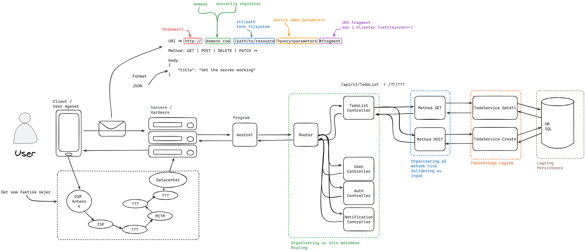

# C# ASP .NET Core Introduction

## Week 1  - *Create a RESTful API supporting CRUD operations*

### Goals

- A Web API using ASP .NET Core serving multiple routes
- Defining simple data models
- Persisting data in memory

### Lecture 1
- Showcase realworld usage
  - [data.norge.no](https://data.norge.no/)
  - [brreg.no](https://www.brreg.no/produkter-og-tjenester/apne-data/)
  - [pokeapi.no](https://pokeapi.co/)
  - [wetherforcast.now](https://openweathermap.org/api)
- Create an ASP .NET Core Web API
- Showcase the builder pattern
- Setup a controller with hardcoded return messages

### Lecture 2
- Define a simple Data Model
- Define a Storage Interface
- Implement it using an in-memory DB
- Register it as a singleton service

## Client-Server Architecture

## Week 2  - *Service Oriented Architecture and Querying*

### Goals

- Have an understanding of Service Oriented Architecture
- Understand the usage of a Dependency Injection Container
- Be able to define new interfaces and register them with the DI Container
- Implement interfaces in multiple ways
- Use LINQ for
  - Querying
  - Filtering
  - Sorting
  - Transforming

### Lecture 1
- Introduce Service Oriented Architecture
- Introduce DI Containers
    - Show a Singleton service
    - Show a Scoped service
    - Show a transient service
- Define a logger interface
    - Create a stdout logger
    - Create a filesystem logger

### Lecture 2
- Introduce LINQ
- Setup an endpoint for querying the data set
    - Filter by properties
    - Sort by properties
- More complex querries
    - ?? Bigger Dataset??

## Week 3  - *Documentation and Security*

### Goals

- Document interfaces using XML Docstrings
- Document RESTful Web Interfaces through OpenAPI
- Knowledge of ER and Class modeling tools
- Knowledge of
  - Identity
  - Signatures
  - Encryption
- Knowledge of the Public Key Infrastructure
- Able to generate and make use of TLS/SSL Certificates
- Understand the importance of Certificates

### Lecture 1
- Show how to document interfaces and classes
- Setup OpenAPI for endpoints

- Introduce Entity Relationship and Class Diagrams
- Walk through of how to model a bookstore
    - Loaners
    - Books
    - Loans

### Lecture 2
- Security
- Identity, Signing, Encryption
- HTTP/HTTPS
- Public Key Infrastructure
- TLS/SSL Certificates
    - *.{pem, pfx, crt,++}
- Chain of Trust
- Let's Encrypt
- Access Managment
    - RBAC
    - ABAC

## References

- [RESTful API Architecture](https://www.geeksforgeeks.org/rest-api-architectural-constraints/)
- [ASP .NET Core Web API](https://learn.microsoft.com/en-us/aspnet/core/web-api/?view=aspnetcore-8.0)
- [Builder Pattern](https://medium.com/@lexitrainerph/c-builder-pattern-constructing-objects-step-by-step-97b583246599)
- [ASP .NET Core Controller based Web API](https://learn.microsoft.com/en-us/aspnet/core/web-api/?view=aspnetcore-8.0)
- User Clients
    - A browser
    - [curl](https://curl.se/)
    - [PostMan](https://www.postman.com/)
    - [VS Code Extension Thunder Client](https://www.thunderclient.com/)
- [LINQ](https://learn.microsoft.com/en-us/dotnet/csharp/linq/standard-query-operators/)
- [LINQ Full list of methods](https://learn.microsoft.com/en-us/dotnet/api/system.linq.enumerable?view=net-8.0)

## Further Reading

- [Bookstore API Example](https://chatgpt.com/share/d1a1c2fc-2cff-4950-a4e3-d0bea29cb35b)
